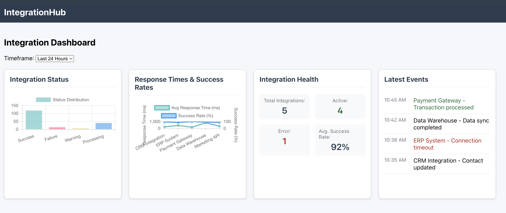
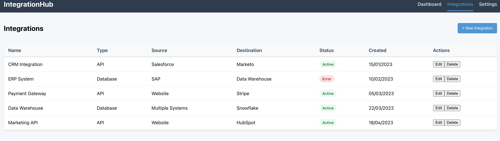

# IntegrationHub Dashboard

A real-time monitoring dashboard for enterprise integrations with drag-and-drop configuration, data visualization, and metrics tracking.

## Table of Contents

- [Features](#features)
- [Tech Stack](#tech-stack)
- [Project Structure](#project-structure)
- [Screenshots](#screenshots)
- [Getting Started](#getting-started)
  - [Prerequisites](#prerequisites)
  - [Installation](#installation)
  - [Configuration](#configuration)
  - [Running the Application](#running-the-application)
- [API Endpoints](#api-endpoints)
  - [Integrations](#integrations)
  - [Metrics](#metrics)
- [WebSocket Events](#websocket-events)
- [System Architecture](#system-architecture)
  - [High-Level Architecture](#high-level-architecture)
  - [Data Flow Diagram](#data-flow-diagram)
  - [Component Interaction Flow](#component-interaction-flow)
- [Database Schema](#database-schema)
  - [Integrations Table](#integrations-table)
  - [Metrics Table](#metrics-table)
- [License](#license)

## Features

- Real-time monitoring of integration status and performance
- Drag-and-drop configuration of integration components
- Detailed metrics and data visualization
- WebSocket-based live updates
- MariaDB for reliable relational data storage

## Tech Stack

- **Frontend**: React.js, Chart.js, React Beautiful DnD
- **Backend**: Node.js, Express.js
- **Database**: MariaDB, Sequelize ORM
- **Real-time Communication**: Socket.io

## Project Structure

```
integration-hub/
├── client/             # React frontend
│   ├── public/         # Static files
│   └── src/            # Source code
│       ├── components/ # UI components
│       ├── contexts/   # React contexts
│       ├── hooks/      # Custom hooks
│       ├── pages/      # Page components
│       ├── utils/      # Utility functions
│       └── App.js      # Main React component
├── server/             # Node.js/Express backend
│   ├── config/         # Configuration files
│   ├── controllers/    # Route controllers
│   ├── models/         # MongoDB schemas
│   ├── routes/         # API routes
│   └── server.js       # Entry point
└── package.json        # Project dependencies
```

## Screenshots

### Dashboard Home Page



### Integrations Management Page



## Getting Started

### Prerequisites

- Node.js (v14+)
- MariaDB (v10.6+)

### Installation

1. Clone the repository
2. Install dependencies:

```bash
npm run install-all
```

This will install dependencies for the root project, client, and server.

### Configuration

Create a `.env` file in the server directory with the following variables:

```
PORT=5000
DB_NAME=integration_hub
DB_USER=root
DB_PASSWORD=
DB_HOST=localhost
DB_PORT=3306
JWT_SECRET=your_jwt_secret_key
CLIENT_URL=http://localhost:3000
```

### Running the Application

```bash
npm start
```

This will start both the client and server concurrently:
- Client: http://localhost:3000
- Server: http://localhost:5000

## API Endpoints

### Integrations
- `GET /api/integrations` - Get all integrations
- `GET /api/integrations/:id` - Get a specific integration
- `POST /api/integrations` - Create a new integration
- `PUT /api/integrations/:id` - Update an integration
- `DELETE /api/integrations/:id` - Delete an integration

### Metrics
- `GET /api/metrics` - Get all metrics
- `GET /api/metrics/integration/:integrationId` - Get metrics for a specific integration
- `GET /api/metrics/dashboard` - Get aggregated metrics for the dashboard
- `POST /api/metrics` - Create a new metric

## WebSocket Events

- `integrationCreated` - When a new integration is created
- `integrationUpdated` - When an integration is updated
- `integrationDeleted` - When an integration is deleted
- `metricCreated` - When a new metric is recorded

## System Architecture

### High-Level Architecture

```
+------------------+            +------------------+            +------------------+
|                  |            |                  |            |                  |
|    Client        |  <------>  |    Server        |  <------>  |    Database      |
|    (React)       |  HTTP/WS   |    (Node.js)     |   SQL      |    (MariaDB)     |
|                  |            |                  |            |                  |
+------------------+            +------------------+            +------------------+
        ^                             ^                               |
        |                             |                               |
        |                             |                               |
        v                             v                               v
+------------------+            +------------------+        +------------------+
|                  |            |                  |        |                  |
|  UI Components  |            |    API Routes    |        |     Database     |
|  & State Mgmt   |            |  & Controllers   |        |      Models      |
|                  |            |                  |        |                  |
+------------------+            +------------------+        +------------------+
```

### Data Flow Diagram

```
   +----------------+           +----------------+          +----------------+
   |                |           |                |          |                |
   |   User Actions |---------->| API Endpoints  |--------->| Database       |
   |                |           |                |          | Operations    |
   +----------------+           +----------------+          +----------------+
           |                           |                           |
           v                           v                           v
   +----------------+           +----------------+          +----------------+
   |                |           |                |          |                |
   | React State    |<----------| API Responses  |<---------| Data Results   |
   | Update         |           |                |          |                |
   +----------------+           +----------------+          +----------------+
           |
           |
           v
   +----------------+           +----------------+
   |                |           |                |
   | Real-time      |<----------| WebSocket      |
   | UI Updates    |           | Events         |
   |                |           |                |
   +----------------+           +----------------+
```

### Component Interaction Flow

```
+--------------------+      +--------------------+      +--------------------+
|                    |      |                    |      |                    |
|  Integration List  |----->|  Integration      |----->|  Metrics           |
|  Component        |      |  Detail Component |      |  Charts Component |
|                    |      |                    |      |                    |
+--------------------+      +--------------------+      +--------------------+
         |                          |                          |
         v                          v                          v
+--------------------+      +--------------------+      +--------------------+
|                    |      |                    |      |                    |
|  Integration Form |      |  WebSocket        |      |  Drag-and-Drop    |
|  Component        |      |  Context          |      |  Container        |
|                    |      |                    |      |                    |
+--------------------+      +--------------------+      +--------------------+
         |                          |                          |
         |                          |                          |
         v                          v                          v
+--------------------------------------------------------------------+
|                                                                    |
|                         API Service Layer                          |
|                                                                    |
+--------------------------------------------------------------------+
```

## Database Schema

### Integrations Table

| Column         | Type          | Description                          |
|---------------|---------------|--------------------------------------|
| id            | INT (PK)      | Primary key                          |
| name          | VARCHAR(255)  | Integration name                     |
| description    | TEXT          | Description of the integration      |
| type          | ENUM          | API, Database, File, etc.            |
| status        | ENUM          | Active, Inactive, Error              |
| config        | JSON          | Configuration details                |
| source        | VARCHAR(255)  | Source system                        |
| destination   | VARCHAR(255)  | Destination system                   |
| createdBy     | VARCHAR(255)  | User who created the integration    |
| lastModified  | DATETIME      | Last modification timestamp         |
| createdAt     | DATETIME      | Creation timestamp                  |
| updatedAt     | DATETIME      | Update timestamp                    |

### Metrics Table

| Column         | Type          | Description                          |
|---------------|---------------|--------------------------------------|
| id            | INT (PK)      | Primary key                          |
| integrationId | INT (FK)      | Foreign key to Integrations          |
| timestamp     | DATETIME      | When the metric was recorded        |
| status        | ENUM          | Success, Failure, Warning, Processing|
| responseTime  | INT           | Response time in milliseconds       |
| dataVolume    | INT           | Volume of data in bytes             |
| errorMessage  | TEXT          | Error message if status is Failure  |
| successCount  | INT           | Number of successful operations     |
| failureCount  | INT           | Number of failed operations         |
| metadata      | JSON          | Additional metric data              |
| createdAt     | DATETIME      | Creation timestamp                  |
| updatedAt     | DATETIME      | Update timestamp                    |

## License

ISC
